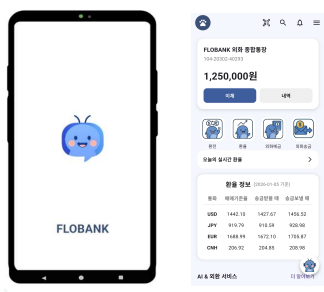
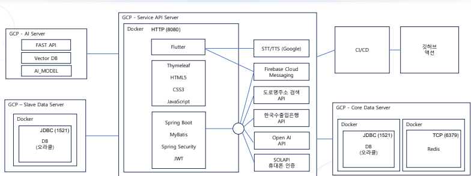

<div align="center">

# 🏦 FLOBANK (플로뱅크)

### AI 음성 비서와 외환 서비스를 하나의 흐름으로 연결한 사용자 중심 외환 특화 뱅킹 앱

**부산은행 × 그린컴퓨터아카데미 산학 협력 은행 앱 개발 프로젝트**<br />
🏆 **최우수상 수상 프로젝트**

<br />


</div>

---

## 📌 프로젝트 한 줄 요약

복잡하게 흩어진 **환율 조회 · 환전 · 외화예금 · 외화송금** 서비스를 하나의 자연스러운 **Flow**로 통합하고,<br />
AI 음성 비서와 OCR 기반 기능을 통해 초보 사용자도 쉽게 이용할 수 있는 외환 금융 경험을 제공하는 은행 앱입니다.

---

## 👥 팀 구성

| 역할 | 이름 |
| --- | --- |
| **팀장** | **이민준** |
| 팀원 | 김대현 |
| 팀원 | 이다은 |
| 팀원 | 이지민 |
| 팀원 | 서현우 |
| 팀원 | 전용준 |

---

## 🧭 프로젝트 개요

기존 외환 서비스는 환율 조회, 환전, 외화예금 가입, 외화송금이 각각 분리되어 있어 사용자가 여러 메뉴를 오가야 하는 불편함이 있었습니다.<br />
**FLOBANK**는 외환 금융 여정을 하나의 흐름으로 재구성하고, AI 기반 가이드와 자동화된 인프라를 결합해 더 쉽고 안정적인 금융 서비스를 구현하는 것을 목표로 했습니다.

| 구분 | 내용 |
| --- | --- |
| 프로젝트명 | FLOBANK (플로뱅크) |
| 진행 기관 | 부산은행, 그린컴퓨터아카데미 |
| 프로젝트 성격 | 산학 협력 실무 프로젝트 / 2차 프로젝트 |
| 핵심 키워드 | 외환 특화 뱅킹, AI 음성 비서, OCR, 고가용성, 자동 Failover |
| 주요 성과 | **최우수상 수상** |

---
## 🖼️ 실행 화면

### 실행 화면 1

<p align="center">
  
</p>

### 실행 화면 2

<p align="center">
  
</p>

---

## 🧱 아키텍처

FLOBANK는 모바일 앱, Spring Boot 백엔드, Oracle 이중화 DB, Redis 비동기 처리, GCP 배포 환경을 기반으로 구성했습니다.

<p align="center">
  
</p>

### 주요 구성

* **GCP 기반 서버 인프라** 구축
* **Oracle DB Master / Slave 이중화** 구성
* **Redis Queue 기반 비동기 로그 처리** 구조 적용
* **GitHub Actions 기반 CI/CD 자동 배포 파이프라인** 구축
* **Spring Security + JWT 기반 인증/인가** 적용

---

## ✨ 핵심 기능

### 1. AI 음성 기반 외화예금 가입 가이드

복잡한 외화예금 가입 절차를 AI 음성 비서가 단계별로 안내합니다.

* Server-side **State Machine(S0~S5)** 기반 가입 흐름 관리
* 사용자 Intent를 서버에서 판단하여 다음 단계 결정
* Flutter **Global Overlay UI**로 앱 어디서든 음성 대화 유지
* 금융 용어와 가입 절차를 자연어 기반으로 설명

### 2. 외환 서비스 통합 플로우

환율 조회, 환전, 외화예금, 외화송금 기능을 하나의 서비스 경험으로 연결했습니다.

* 주요 통화별 환율 조회
* 온라인 환전 신청 및 처리
* 외화예금 상품 조회 및 가입
* 외화송금 프로세스 제공

### 3. 실시간 환율 스캐너 OCR

카메라로 환율표를 비추면 실시간으로 텍스트를 인식하고 환율 데이터를 추출합니다.

* Google ML Kit `TextRecognizer` 활용
* 카메라 화면의 환율 텍스트 실시간 인식
* 정규표현식 기반 가격 데이터 필터링
* 인식된 외화 금액을 원화 기준으로 환산

### 4. GARCH 모델 기반 환율 변동성 예측

과거 환율 데이터를 활용해 다음 날 환율 변동 위험을 예측합니다.

* `GARCH(1,1)` 모델 적용
* 익일 환율 변동 폭 예측
* 분산 값을 표준편차로 변환해 사용자 친화적인 위험도 제공

### 5. 관리자 및 고객 지원 기능

금융 서비스 운영에 필요한 관리자 기능과 고객 지원 기능을 함께 구현했습니다.

* 공지사항, FAQ, 이벤트 관리
* 챗봇 상담 및 상담 이력 관리
* 상품/약관 검색 및 AI 기반 문서 질의
* 설문, 리뷰, 알림 등 사용자 참여 기능

---

## 🔐 안정성 및 인프라 구현

### 고가용성 아키텍처 & 자동 장애 조치

금융 서비스의 핵심 요건인 안정성과 연속성을 고려해 장애 대응 구조를 설계했습니다.

* Oracle **Master / Slave Replication** 구성
* `DbHealthChecker`를 통한 주기적 DB 상태 점검
* 장애 감지 시 `ReplicationRoutingDataSource`를 통해 Slave DB로 즉시 Failover
* Redis Queue 기반 비동기 로그 처리로 DB 병목 완화
* 핵심 비즈니스 로직과 로그 처리 로직을 분리해 장애 전파 최소화

### CI/CD 및 배포

* GitHub Actions 기반 자동 빌드/배포 파이프라인 구성
* GCP 서버 환경 구축
* Nginx 기반 라우팅 및 서비스 배포 환경 구성
* 운영 관점의 확장성과 복구 가능성을 고려한 인프라 설계

---

## 🧩 트러블슈팅

| 문제 | 원인 | 해결 |
| --- | --- | --- |
| 음성 비서 무한 루프 | 인식 실패 시 동일 상태 반복 | Retry Counter 및 Guard 로직 도입, 3회 실패 시 ERROR 상태 전이 |
| DB 동기화 실패로 인한 트랜잭션 충돌 | Master/Slave 처리 흐름 혼재 | Slave 저장 로직 트랜잭션 분리, 핵심 로직과 로그 처리 분리 |
| 외환 데이터 처리 병목 | 동기 로그 저장으로 요청 처리 지연 | Redis Queue 기반 비동기 처리 구조 적용 |

---

## 🛠️ 기술 스택

| 영역 | 기술 |
| --- | --- |
| **Frontend** | Flutter, Dart |
| **Backend** | Java 17, Spring Boot 3.x, MyBatis, Spring Security, JWT |
| **Database / Cache** | Oracle DB, Redis, Elasticsearch |
| **AI / OCR** | OpenAI API, Google Gemini, Google ML Kit |
| **DevOps** | Docker, GCP, Nginx, GitHub Actions |
| **Collaboration** | Git, GitHub |

---

## 📁 프로젝트 구조

```text
FLOBANK_Project2
├── backend/          # Spring Boot 기반 백엔드 서버
├── bnk_proj/         # Flutter 기반 모바일 앱
├── README.md         # 프로젝트 소개 문서
└── images/           # README 및 프로젝트 소개용 이미지
```

---

## 🚀 실행 방법

### Backend

```bash
cd backend
./gradlew bootRun
```

### Frontend

```bash
cd bnk_proj
flutter pub get
flutter run
```

> 실행 전 DB, Redis, API Key, 외부 연동 정보 등 환경 변수 및 설정 파일 구성이 필요합니다.

---

## 📊 프로젝트 결과

* **AI 음성 비서 + OCR** 기반 차별화된 외환 금융 UX 구현
* **Oracle Master/Slave + 자동 Failover** 기반 고가용성 구조 설계
* **Redis 비동기 처리**로 로그 저장 병목 완화
* **GARCH 모델** 기반 환율 변동성 예측 기능 구현
* **GitHub Actions + GCP** 기반 배포 자동화 경험 확보
* 산학 협력 프로젝트 **최우수상 수상**으로 완성도 검증

---

## 📄 결과 보고서

* [최종 결과 보고서 (Google Drive)](https://drive.google.com/file/d/1LWS5zEJrTKAV466jentCkP0gNsPNK7_0/view)

---

## 💬 회고

> 기능 구현에 그치지 않고, 실제 금융 서비스라면 필요한 안정성·확장성·운영성을 함께 고민한 프로젝트였습니다.<br />
> 팀원들과 함께 외환 서비스의 사용자 흐름을 재설계하고, AI와 인프라 기술을 접목하며 실무형 프로젝트 경험을 쌓을 수 있었습니다.

---

<div align="center">

**FLOBANK와 함께 더 쉬운 외환 금융 경험을 만들어갑니다.**

</div>
